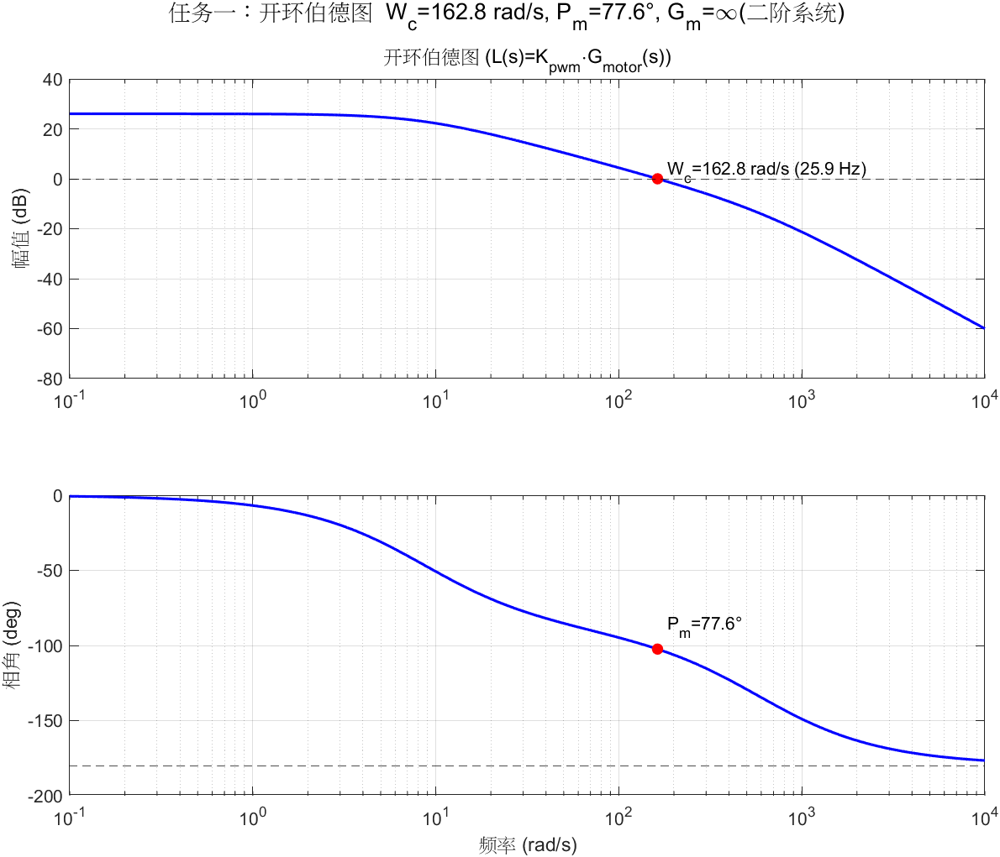
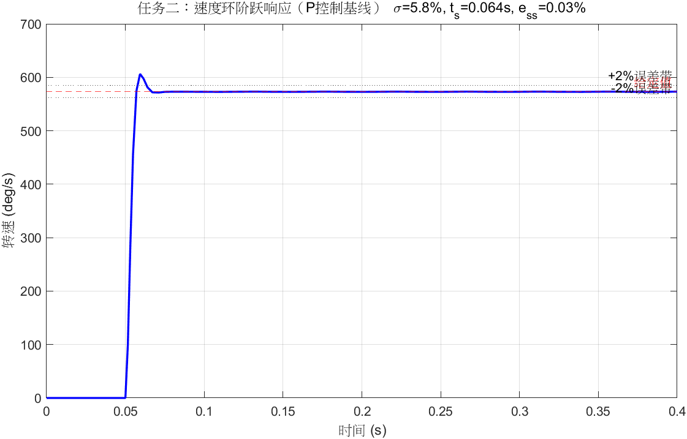
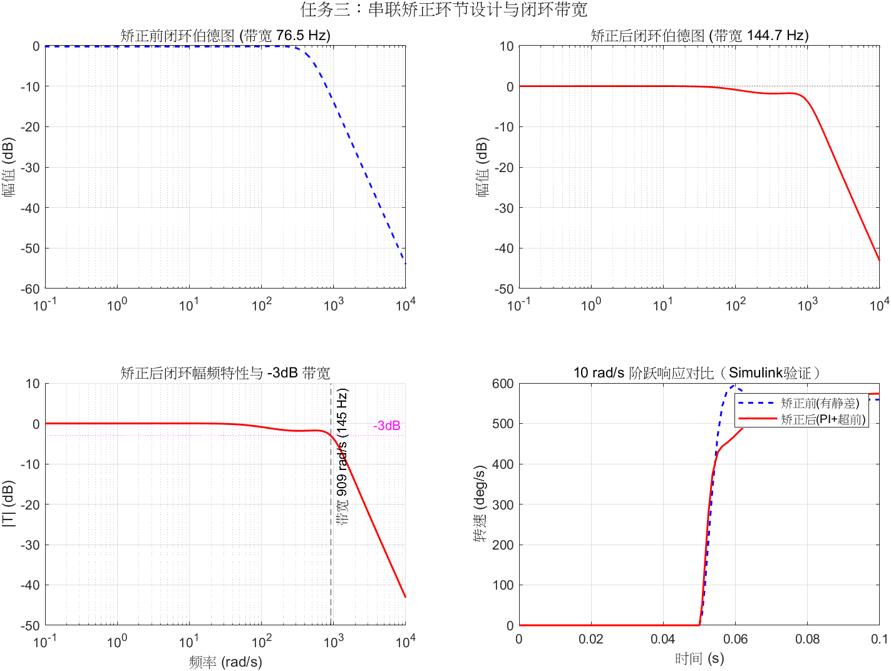
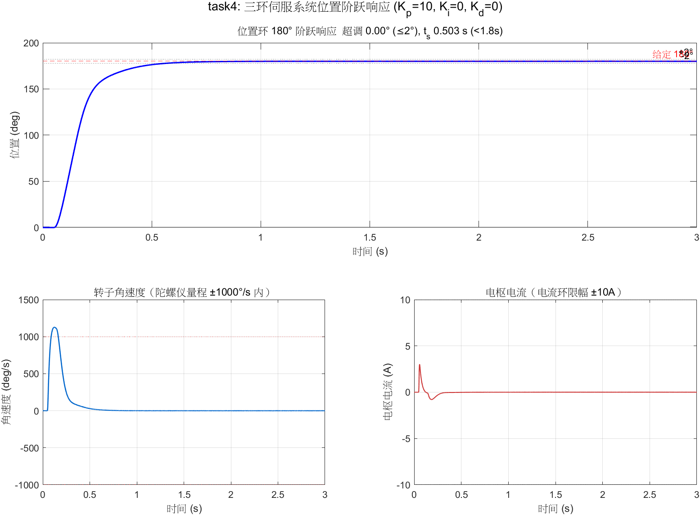
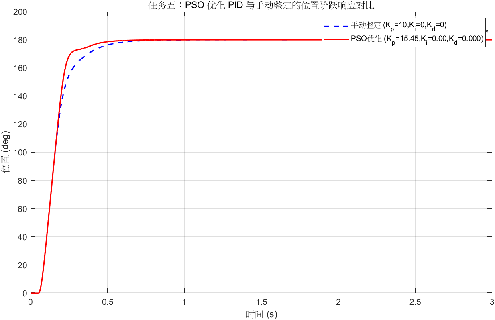
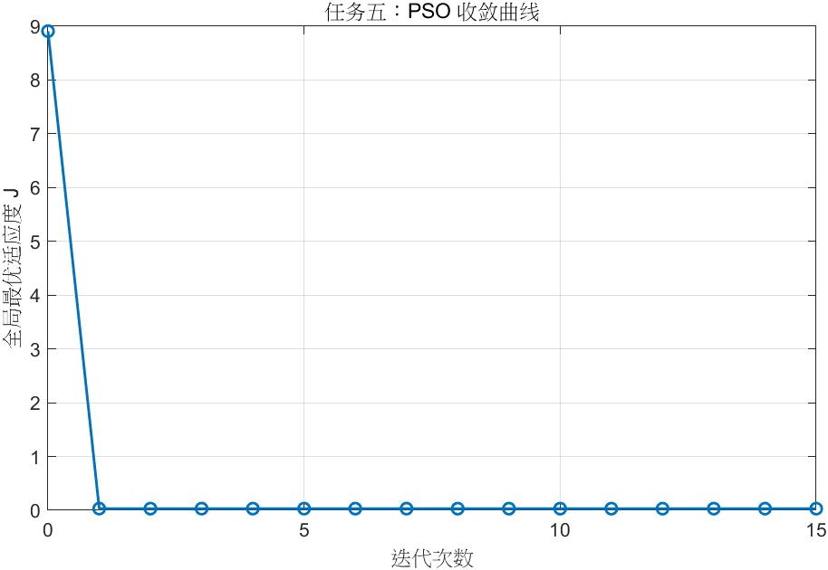

<div align="center">

# 🎛️ 直流有刷电机三环伺服控制系统建模与仿真

**基于 MATLAB R2024a / Simulink 的自动控制原理课程设计**

[](https://www.mathworks.com/)
[](https://www.mathworks.com/products/simulink.html)
[](#-安装与使用)
[](./LICENSE)
[](#-任务与仿真结果)

*电流环 · 速度环 · 位置环 —— 从电机建模到 PSO 智能整定的完整闭环*

</div>

---

## 📖 项目介绍

直流有刷电机是伺服系统中最经典的执行机构：转子电流在定子磁场中受安培力驱动旋转，
**输出转矩 ∝ 电枢电流**，因此工业上采用**三环级联**结构对其进行控制——

```
位置环 PID ──► 速度环 PI ──► 电流环 PI ──► PWM/H桥 ──► 直流电机
    ▲              ▲              ▲                        │
    │              │              └──── 电流采样(1/f噪声) ──┤
    │              └────────── 陀螺仪(30~100Hz噪声) ──────┤
    └──────────────────── 编码器(16位量化) ───────────────┘
```

本项目从**电机物理方程推导**出发，在 Simulink 中搭建了包含驱动限幅、传感器量化与频段噪声模型的完整三环伺服系统，完成课程任务书规定的全部 5 项任务：
频率特性分析、速度环动态指标测定、串联矫正设计、位置阶跃验证，以及
**粒子群算法（PSO）仿真在环自动整定 PID**。

> 🎯 全部指标达标且留有裕量：位置 180° 阶跃**超调 0.003°（要求 ≤2°）**、
> **调节时间 0.503 s（要求 <1.8 s）**。

---

## ✨ 核心功能

- 🧮 **理论建模** — 电枢电压方程 + 机械运动方程 → 二阶电机传递函数，Simulink
  线性化结果与解析式系数完全一致（偏差 ≈ 0）
- 📊 **频域分析** — 开环伯德图、截止频率、相位/幅值裕度自动计算与标注
- 🛠️ **控制器设计** — 电流环/速度环 PI 零极点对消整定、位置环 PID 手动整定 +
  **PSO 群体智能寻优**（~290 次仿真在环评估，Fast Restart 加速）
- 🏭 **工程级仿真细节** — 1 ms 离散 PID、电压 ±24 V / 电流 ±10 A 限幅、
  抗积分饱和（clamping）、16 位编码器量化、陀螺仪 ±1000°/s 量程、
  按 PPT 规定频段注入测量噪声（电流 1/f、速度 30–100 Hz、位置 20–60 Hz）
- 📈 **一键复现** — 每个任务一个独立脚本，运行即自动建模 → 仿真 → 算指标 → 出图

---

## 📊 任务与仿真结果

| # | 任务 | 关键结果 | 结论 |
|:---:|---|---|:---:|
| 1️⃣ | 开环伯德图、截止频率、相位裕度 | **Wc = 162.8 rad/s (25.9 Hz)**，**Pm = 77.6°**，Gm = ∞ | ✅ 稳定裕量充足 |
| 2️⃣ | 速度环阶跃响应（P 控制基线） | 超调 **5.79%**，稳定时间 **0.064 s**，静差 **0.03%** | ✅ 暴露静差问题，引出矫正 |
| 3️⃣ | 串联矫正（PI + 超前网络）与闭环带宽 | 带宽 **76.5 → 144.7 Hz**（+89%），Pm 64.6° → 75.4°，静差归零 | ✅ 频带展宽裕度提升 |
| 4️⃣ | 三环系统 180° 位置阶跃 | 超调 **0.003°**（≤2°），调节时间 **0.503 s**（<1.8 s） | ✅ 大幅优于指标 |
| 5️⃣ | 🧠 PSO 优化位置环 PID（附加题） | **Kp=15.45, Ki=0, Kd=0**，调节时间 **0.407 s**（再快 19%） | ✅ 自动整定更优 |

### 🖼️ 仿真结果预览

<details open>
<summary><b>任务一 · 开环伯德图（点击折叠/展开）</b></summary>
<br>



</details>

<details>
<summary><b>任务二 · 速度环阶跃响应</b></summary>
<br>



</details>

<details>
<summary><b>任务三 · 矫正后闭环幅频特性与带宽</b></summary>
<br>



</details>

<details>
<summary><b>任务四 · 三环系统 180° 位置阶跃响应</b></summary>
<br>



</details>

<details>
<summary><b>任务五 · PSO 对比与收敛曲线</b></summary>
<br>





</details>

---

## 🧮 系统模型与参数

### 电机数学模型

$$U_a = L_a \frac{di_a}{dt} + R_a i_a + K_b\omega, \qquad J_e\frac{d\omega}{dt} = K_m i_a$$

$$G_{open}(s)=\frac{\omega(s)}{U_a(s)}=\frac{K_m/J_e}{s\,(R_a+L_a s)+K_m K_b/J_e}$$

### 电机参数（典型 24 V 有刷伺服电机，减速比 1:1）

| 参数 | 数值 | 物理依据 |
|---|---|---|
| 额定电压 `Un` | 24 V | 常见伺服母线电压 |
| 电枢电阻 `Ra` | 1.5 Ω | 绕组工艺决定，额定电流 3~5 A |
| 电枢电感 `La` | 2.5 mH | 电磁时间常数 1.67 ms ≪ 机械时间常数 |
| 转矩/反电动势系数 `Km = Kb` | 0.05 | SI 单位制下二者相等 |
| 转动惯量 `Je` | 2×10⁻⁴ kg·m² | 转子 + 负载折算 |
| 机电时间常数 | 120 ms | 与电磁常数相差 ~70 倍，满足三环频带分离 |

### 控制器与系统配置

| 环节 | 控制器 | 关键整定依据 |
|---|---|---|
| 电流环 | PI（Kpi=0.75, Ti=La/Ra） | 零点对消电磁极点，穿越 ~300 rad/s，限幅 ±10 A |
| 速度环 | PI（Kpv=0.20, Tv=0.08 s） | 穿越 ~50 rad/s，Pm≈76°，限幅 ±24 V |
| 位置环 | PID（PSO 整定） | 输出限幅 ±1000°/s（陀螺仪量程约束） |
| 采样 | 离散 PID，Ts = 1 ms | 远小于各环穿越周期，连续设计有效 |
| 求解器 | 固定步长 ode4，1×10⁻⁴ s | 电气极点 594 rad/s 远离步长限制 |

---

## 🔧 安装与使用

### 环境要求

| 依赖 | 版本 |
|---|---|
| MATLAB | **R2024a**（或相近版本） |
| Simulink | ✅ 必需 |
| Control System Toolbox | ✅ 必需（`tf`/`bode`/`margin`） |

### 🚀 三步运行

**① 克隆仓库**

```bash
git clone https://github.com/<YangCafeL>/auto-control-course-design.git
cd auto-control-course-design/matlab
```

**② 在 MATLAB 中打开该目录**，依次运行五个任务脚本：

```matlab
task1_openloop        % 任务一：开环伯德图 + 裕度      (~3 min)
task2_speed_step      % 任务二：速度环阶跃指标         (~2 min)
task3_lead_comp       % 任务三：矫正设计 + 闭环带宽     (~3 min)
task4_position_step   % 任务四：三环 180° 位置阶跃      (~3 min，自动建模)
task5_pso_pid         % 任务五：PSO 优化 PID          (~5~15 min，290 次仿真)
```

**③ 查看结果** — 指标实时打印到命令行，结果图自动保存至
[`matlab/results/`](./matlab/results/)。

> 💡 **提示**
> - 每个脚本相互独立，可单独运行；
> - 任务四首次运行会自动调用 `build_three_loop_model()` 生成 `task4_three_loop.slx`；
> - 任务五的位置环 PID 增益通过工作区变量 `Kpp / Kpi / Kpd` 注入模型，修改脚本中的
>   `lb / ub` 即可改变 PSO 搜索范围。

### 📁 项目结构

```
📦 auto-control-course-design
├── 📄 README.md                  ← 当前页面
├── 📄 设计报告.md                 ← 完整设计报告（推导/依据/分析）
├── 📄 LICENSE                    ← MIT 许可证
└── 📂 matlab
    ├── 🎛️ motor_params.m          # 电机与控制器公共参数（单一数据源）
    ├── 📜 task1_openloop.m        # 任务一：开环频域分析
    ├── 📜 task2_speed_step.m      # 任务二：速度环动态指标
    ├── 📜 task3_lead_comp.m       # 任务三：串联矫正与带宽
    ├── 📜 task4_position_step.m   # 任务四：三环位置阶跃
    ├── 📜 task5_pso_pid.m         # 任务五：PSO 智能整定
    ├── ⚙️ build_three_loop_model.m # 三环模型自动构建
    ├── ⚙️ run_position_sim.m / report_and_plot.m / settle_metrics.m
    ├── 🧩 task1_model.slx ~ task4_three_loop.slx   # 4 个 Simulink 模型
    └── 📂 results                 # 仿真结果图（8 张 PNG）
```

---

## 📚 文档导航

| 文档 | 内容 |
|---|---|
| [设计报告.md](./设计报告.md) | 摘要、建模推导、参数依据、各任务结果分析、结论 |
| [matlab/README.md](./matlab/README.md) | 脚本清单与结果汇总表 |

## 📄 许可证

本项目基于 [MIT License](./LICENSE) 开源 —— 欢迎学习、复用与改进 🎓

<div align="center">

⭐ **如果本项目对你的课程设计有帮助，欢迎点一个 Star！**

</div>
